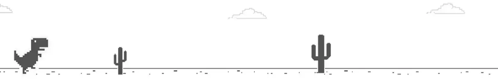

<picture>
  <source media="(prefers-color-scheme: dark)" srcset="github_bannerDark.jpg">
  
</picture>
 
 
I'm currently a university student studying mechanical engineering with a desire to work in either quantitative finance or the aeronautics industry, and would welcome any help getting into either of those fields in the united kingdom. I'm looking to gain experience in coding simulations or bots in languages such as python, C++ and javascript so feel free to reach out if you have any projects you need help with or need a partner for a hackathon (although i've never done one before) 
 
 

 alt="not handwritten">
 alt="not handwritten">

<!--
**thomas-j-vincent/thomas-j-vincent** is a ✨ _special_ ✨ repository because its `README.md` (this file) appears on your GitHub profile.

Here are some ideas to get you started:

- 🔭 I’m currently working on ...
- 🌱 I’m currently learning ...
- 👯 I’m looking to collaborate on ...
- 🤔 I’m looking for help with ...
- 💬 Ask me about ...
- 📫 How to reach me: ...
- 😄 Pronouns: ...
- ⚡ Fun fact: ...
-->
